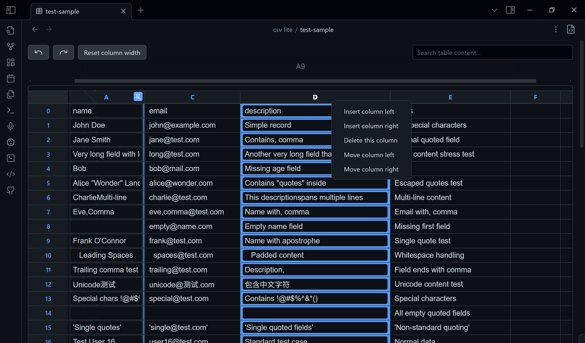

# CSV Lite

Simple enough for csv, no more fancy function you need to learn and think!

[中文版本 Readme](./README_zh.md)

<!--  -->

<!--  -->
<!--  -->

## Introduction

Keep your mind on track! Don't waste time creating fancy tables.

A plugin designed to view and edit `CSV files` directly within Obsidian.

-   **View** CSV files in a clean, readable table.
-   **Search** the entire file to quickly find data (`esc` to clean).
-   **Navigate** easily with numbered rows and columns.
-   **Pin** the selected column so it's always visible.
-   **Toggle** between the table view and raw source-mode.
-   **Edit** cells directly by clicking and typing.
-   **Manage** rows and columns (add, delete, move) with a simple right-click on the header.

I have a plan to design my own database using json and csv only. If you have fancy idea about tables or csv, please feel free to issue (I will consider it in csv-lite or my new plugin) or search it in community. <!-- For in-markdown edit, I recommend `anyblock` with a much more complex syntax. -->

## Why Another CSV Plugin?

There are so many CSV plugins. Why choose this one?

Because it is designed to be simple and straightforward. It also keeps up with the latest Obsidian API and typings. No fancy features—just open and edit.

## Philosophy

-   No fancy UI, SAY NO TO
    -   modals
    -   sidebar
    -   settingTab <!-- -   Readme. Actually it's important to update readme, I hope you won't notice this line QAQ [#33](https://github.com/LIUBINfighter/csv-lite/issues/33) -->
    -   other online docs & tutorials
-   All functions of the ui components above will be covered in a single File view.
-   All in TextFileView/workspace.
-   No more pollution to your vault, all metadata store in `./.obsidian/plugins/csv` in json format. (Currently no `data.json`)
-   Every function must be completed within 3 steps: 
    0. Locate it visually
    1.  Click/Hotkey
    2.  Input (if needed)
    3.  Confirm/Leave
-   The interface should remain minimal yet functional.
-   Users shouldn't need to leave their workflow environment.
-   CSV manipulation should be as natural as text editing.

## Purpose

This plugin enhances Obsidian's functionality by allowing users to work with CSV (Comma-Separated Values) files seamlessly within their vault, eliminating the need to switch between different applications for CSV handling.

## Getting Started

Install the plugin through Obsidian's community plugins section and start viewing your CSV files directly in your notes.

## Trouble Shooting

You can [issue here](https://github.com/LIUBINfighter/csv-lite/issues/new).

> if you encounter any problems exactly with csv, download `test/test-sample.csv` to see what's different from the test csv file. Issue with an screenshot will help us fix it faster.
