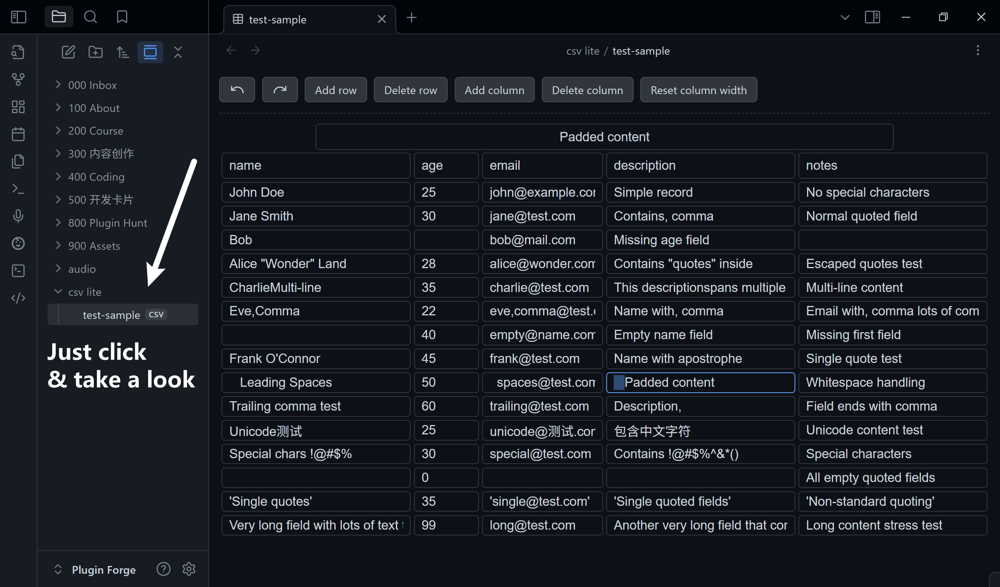
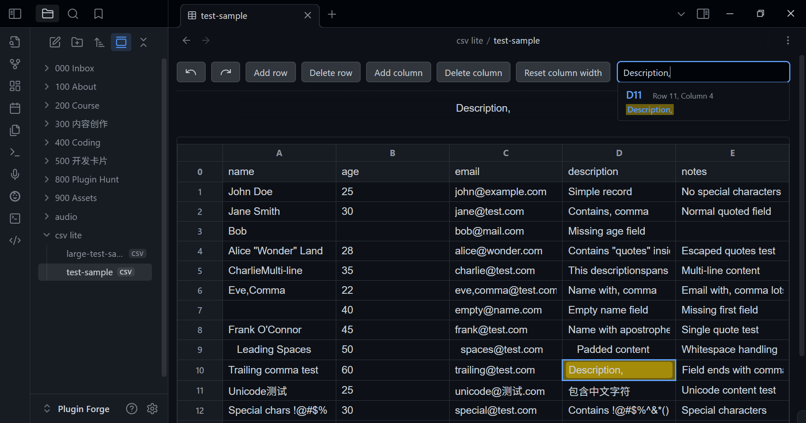
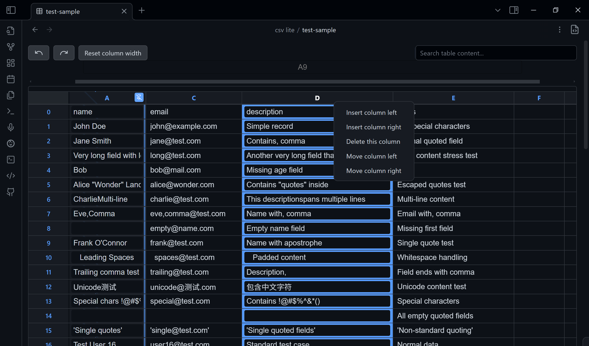

# CSV Lite

足够简单的 CSV 编辑器，无需学习和思考复杂的功能！

[English Version Readme](./README.md)

<!--  -->
<!--  -->

## 简介

保持专注！不要浪费时间创建花哨的表格。

一个旨在直接在 Obsidian 中查看和编辑 `CSV 文件` 的插件。

-   **查看** CSV 文件为整洁、可读的表格
-   **搜索** 整个文件，快速查找数据（按 `esc` 清除）
-   **导航** 轻松，带有编号的行和列
-   **固定** 通过小别针固定列，使其始终可见
-   **切换** 表格视图和原始源码模式
-   **编辑** 直接点击并输入即可编辑单元格
-   **管理** 行和列（添加、删除、移动），只需右键点击表头

我计划仅用 json 和 csv 设计自己的数据库。如果你有关于表格或 csv 的新想法，欢迎提 issue（我会考虑加入 csv-lite 或新插件），或在社区中搜索。<!-- 对于 Markdown 内编辑，推荐 `anyblock`，但语法更复杂。 -->

## 为什么需要另一个 CSV 插件？

已经有很多 CSV 插件了，为什么还要用这个？

因为它设计得足够简单直接，并且始终跟进最新的 Obsidian API 和类型定义。没有花哨功能——只需打开和编辑。

## 理念

-   没有花哨的 UI，拒绝以下内容：
    -   模态框
    -   侧边栏
    -   设置选项卡 <!-- -   Readme. 实际上更新 readme 很重要，希望你不会注意到这一行 QAQ [#33](https://github.com/LIUBINfighter/csv-lite/issues/33) -->
    -   多余的在线文档和教程
-   上述所有 UI 组件的功能都将在单一文件视图中实现
-   一切都在 TextFileView/workspace 中完成
-   不再污染你的库，所有元数据都以 json 格式存储在 `./.obsidian/plugins/csv`（目前没有 `data.json`）
-   每个功能必须在 3 步内完成：
    0. 视觉定位
    1. 点击/快捷键
    2. 输入（如需）
    3. 确认/离开
-   界面应保持极简但实用
-   用户无需离开工作流环境
-   CSV 操作应像文本编辑一样自然

## 目的

本插件增强了 Obsidian 的功能，让用户可以在库内无缝处理 CSV（逗号分隔值）文件，无需在不同应用间切换。

## 开始使用

通过 Obsidian 的社区插件区安装本插件，即可直接在笔记中查看和编辑 CSV 文件。

## 问题捕捉

你可以在[这里 issue](https://github.com/LIUBINfighter/csv-lite/issues/new).

> 如果你遇到任何和csv解析的问题，请下载 `test/test-sample.csv`，对比你的 CSV 文件和测试文件有何不同。提交带有截图的问题可以帮助我们更快地修复。
